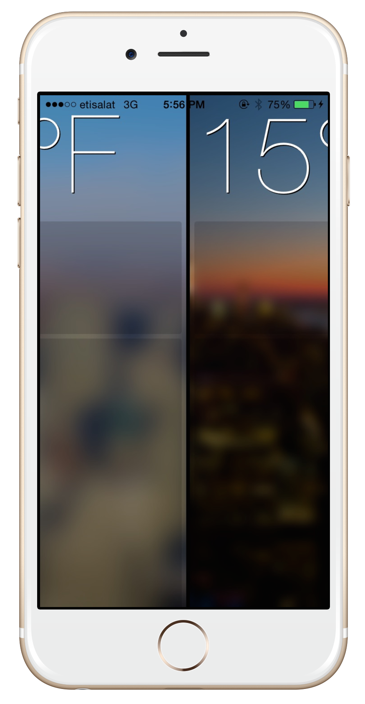

# Glassy
Parallax effect Inspired by Yahoo Weather App

Check this [article on my blog](http://isame7.github.io/)

Purpose
--------------
Glassy is a swift class designed to simplify the implementation of Yahoo weather app parallax effect.

Supported OS & SDK Versions
-----------------------------

* Supported build target - iOS 8.0 (Xcode 6.4)

ARC Compatibility
------------------

Glassy requires ARC. 

## License
Panorama is released under the MIT license. See
[LICENSE](https://github.com/iSame7/glassy/blob/master/LICENSE.md).

Contact
----------

Sameh Mabrouk

[mabrouksameh@gmail.com][2]

[@same7mabrouk][3] 

  [2]: mailto:mabrouksameh@gmail.com
  [3]: http://twitter.com/same7mabrouk
