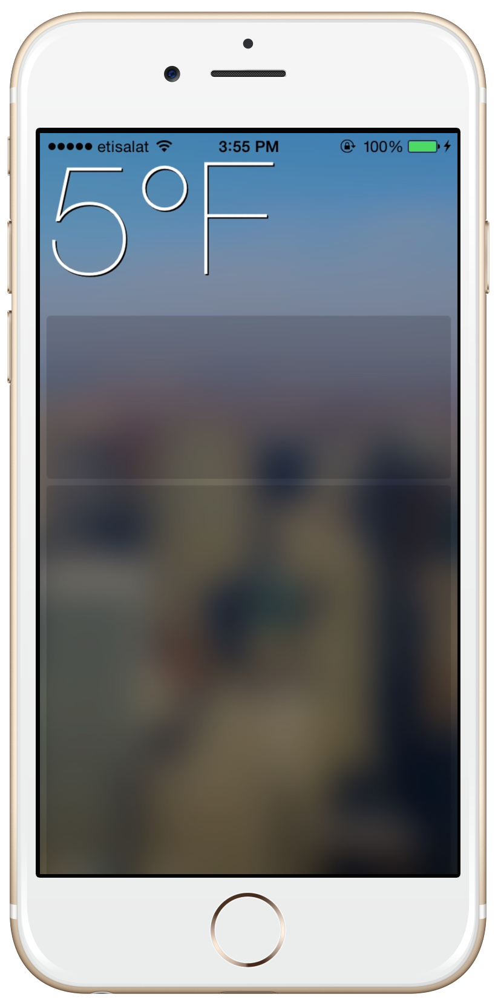

# Glassy
Parallax effect Inspired by Yahoo Weather App

Check this [article on our blog](http://isame7.github.io/)

Purpose
--------------
Glassy is a swift class designed to simplify the implementation of Yahoo weather app parallax effect.

Supported OS & SDK Versions
-----------------------------

* Supported build target - iOS 8.0 (Xcode 6.2)

ARC Compatibility
------------------

KolodaView requires ARC. 
